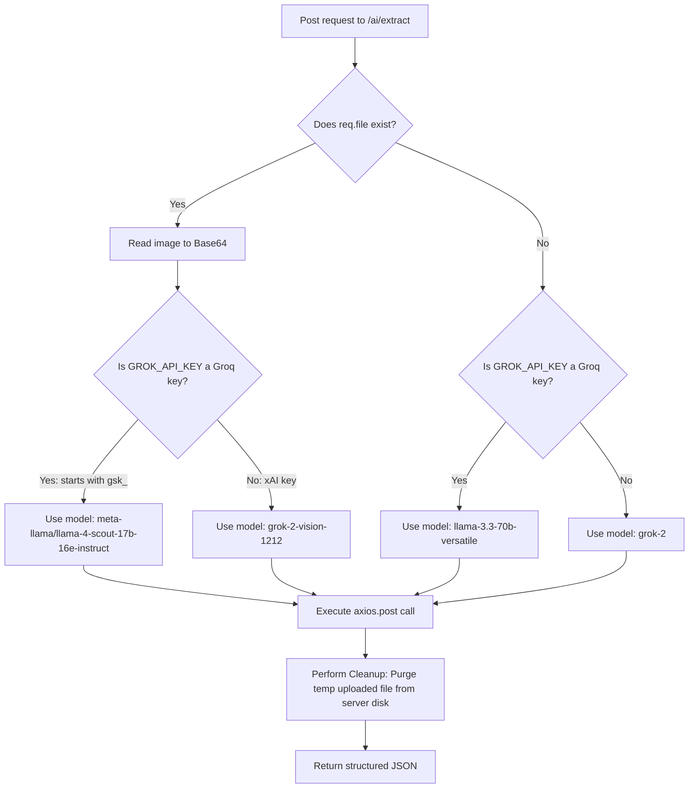

# SpendAI Vision-Enabled AI Autofill Extractor - Frontend Developer Integration Guide

This guide is a comprehensive technical blueprint for frontend developers integrating the **SpendAI Vision-Enabled AI Autofill Extractor API** into a web dashboard application.

---

## 🛣️ API Endpoint Specification

### `POST /api/v1/ai/extract`

Parses unstructured transaction text dumps (SMS transaction receipts, pasted invoices) or physical bill image files (`jpg`, `png`, `gif`) and converts them into structured financial parameters.

*   **Security Guard**: Protected by the global `protect` JWT Bearer token middleware.
*   **Request Headers**:
    `Authorization: Bearer <your_jwt_access_token>`

---

### 📦 Input Mode A: Text-Only (Application/JSON)

Used when a user pastes SMS alert texts, emails, or digitizer copy-paste blocks.

*   **Content-Type**: `application/json`
*   **Request Payload**:
    ```json
    {
      "rawText": "Paid $32.45 for a ride back home from the office with Uber on 2026-05-22"
    }
    ```
*   **Expected Response (200 OK)**:
    ```json
    {
      "success": true,
      "statusCode": 200,
      "message": "AI expense extraction completed successfully",
      "data": {
        "amount": 32.45,
        "category": "Transport",
        "date": "2026-05-22",
        "note": "Uber ride home from office"
      }
    }
    ```

---

### 📷 Input Mode B: Receipt Image Upload (Multipart/Form-Data)

Used when a user snaps a photo of a physical receipt or uploads a digital receipt screenshot.

*   **Content-Type**: `multipart/form-data`
    > [!IMPORTANT]
    > **Do NOT set the `Content-Type` header manually** in your AJAX/fetch call when sending `FormData`. The browser will automatically resolve it, appending the correct boundary parameter hash (e.g. `multipart/form-data; boundary=----WebKitFormBoundary...`). Manually overriding it will crash backend parses.
*   **Form Parameters**:
    *   `receipt` (File Binary, **Required**): JPG, JPEG, PNG, or GIF image file. Size cap: **5MB**.
    *   `rawText` (String, Optional): Accompanying text coordinates or note comments.

*   **JavaScript Compilation Example**:
    ```javascript
    const file = document.getElementById('receipt-file').files[0];
    const rawText = document.getElementById('receipt-text').value;

    const formData = new FormData();
    formData.append('receipt', file);
    if (rawText) {
      formData.append('rawText', rawText);
    }
    ```

---

## 🧠 Smart Routing & Server Architecture



1.  **Vision Model Promotion**: If a file is uploaded, the backend promotes the request to state-of-the-art vision models:
    *   **Groq Cloud API** (`gsk_` prefix): Routes to **`meta-llama/llama-4-scout-17b-16e-instruct`**.
    *   **xAI Grok API**: Routes to **`grok-2-vision-1212`**.
2.  **Strict Storage Purging**: The server processes files in a strict `try-finally` gate. Uploads are instantly **unlinked/purged** from the server's filesystem as soon as the API response resolves.

---

## 🛡️ Critical Edge Cases Frontend Developers MUST Cover

To construct a premium user experience, frontend developers must program defenses against the following edge cases:

### 1. File Format & Size Boundaries (Multer Limits)
*   **Edge Case**: User uploads a `PDF`, `CSV`, or an image larger than **5MB**.
*   **Backend Behavior**: The Multer middleware throws a `400 Bad Request` validation error, returning:
    ```json
    { "success": false, "message": "Invalid file format. Supported: JPEG, JPG, PNG, GIF..." }
    ```
*   **Frontend Defense**:
    *   Inspect file metadata client-side before sending. If `file.size > 5 * 1024 * 1024`, halt execution and trigger a toast warning.
    *   Set the `accept="image/*"` attribute on the `<input type="file">` tag to restrict file selections in the OS browser dialogue.

### 2. The "Review-before-Save" Confirmation Flow
*   **Edge Case**: AI successfully extracts information but might slightly miscalculate numbers, get a wrong date, or return a wrong note.
*   **Frontend Defense**:
    *   **Never save the extraction directly to the ledger!**
    *   Instead, display a glassmorphic **Review Form** pre-populated with the extracted `amount`, `category`, `date`, and `note`.
    *   Allow users to edit these fields manually, then confirm saving using a `POST /api/v1/expenses` call.

### 3. AI Parsing Fallbacks
*   **Edge Case**: The receipt image is blurry, or the pasted text contains incomplete data (e.g. no transaction date or store name).
*   **Backend Behavior**: The service resolves this elegantly by applying safe fallbacks rather than crashing:
    *   No date found: Defaults to the **current date** (`YYYY-MM-DD`).
    *   No amount found: Defaults to `0.00`.
    *   No clear note: Defaults to `'AI Extracted Expense'`.
    *   No category matched: Defaults to `'Other'`.
*   **Frontend Defense**: Warn the user via a subtle tooltip or highlight on fields that returned fallback defaults so they review them closely.

### 4. Preventing Double Submissions (Debouncing)
*   **Edge Case**: User double-clicks the extract button while the LLM parses the receipt, triggering parallel expensive API calls.
*   **Frontend Defense**:
    *   Disable the submission button and show a pulsing skeleton loader the millisecond the request starts.
    *   Re-enable only when the fetch promise resolves or rejects.

### 5. Type Casting
*   **Edge Case**: The confirmation input is a string (`"42.50"`), but the database expects a number.
*   **Frontend Defense**: Always cast the amount value using `Number(amountField.value)` before saving the expense.

---

## ⚛️ React + TypeScript Uploader Component

This complete, drop-in React component implements receipt image uploads, text pastures, loaders, dynamic preview forms, and final confirm-save API calls.

```tsx
import React, { useState, useRef } from 'react';

interface ExtractedData {
  amount: number;
  category: string;
  date: string;
  note: string;
}

export const AIReceiptAutofill: React.FC<{ onSaveSuccess: () => void }> = ({ onSaveSuccess }) => {
  const [rawText, setRawText] = useState('');
  const [selectedFile, setSelectedFile] = useState<File | null>(null);
  const [loading, setLoading] = useState(false);
  const [extractedData, setExtractedData] = useState<ExtractedData | null>(null);
  
  const fileInputRef = useRef<HTMLInputElement>(null);

  // 1. Dispatch Extraction Request
  const handleExtract = async (e: React.FormEvent) => {
    e.preventDefault();
    if (!rawText && !selectedFile) {
      alert('Please enter receipt details or upload a receipt image');
      return;
    }

    setLoading(true);
    setExtractedData(null);

    try {
      let response;
      const headers: HeadersInit = {
        Authorization: `Bearer ${localStorage.getItem('cord4_token')}`
      };

      if (selectedFile) {
        // Multipart Mode
        const formData = new FormData();
        formData.append('receipt', selectedFile);
        if (rawText) formData.append('rawText', rawText);

        response = await fetch('/api/v1/ai/extract', {
          method: 'POST',
          headers,
          body: formData
        });
      } else {
        // JSON Mode
        response = await fetch('/api/v1/ai/extract', {
          method: 'POST',
          headers: {
            ...headers,
            'Content-Type': 'application/json'
          },
          body: JSON.stringify({ rawText })
        });
      }

      const res = await response.json();
      if (!res.success) throw new Error(res.message);

      setExtractedData(res.data);
    } catch (err: any) {
      alert(`AI Extraction Failed: ${err.message}`);
    } finally {
      setLoading(false);
    }
  };

  // 2. Dispatch Confirmed Ledger Item Save
  const handleConfirmSave = async (e: React.FormEvent) => {
    e.preventDefault();
    if (!extractedData) return;

    try {
      const response = await fetch('/api/v1/expenses', {
        method: 'POST',
        headers: {
          'Content-Type': 'application/json',
          Authorization: `Bearer ${localStorage.getItem('cord4_token')}`
        },
        body: JSON.stringify(extractedData)
      });

      const res = await response.json();
      if (!res.success) throw new Error(res.message);

      alert('Expense recorded and saved to ledger!');
      resetForm();
      onSaveSuccess(); // Trigger dashboard reload
    } catch (err: any) {
      alert(`Failed to save expense: ${err.message}`);
    }
  };

  const resetForm = () => {
    setRawText('');
    setSelectedFile(null);
    setExtractedData(null);
    if (fileInputRef.current) fileInputRef.current.value = '';
  };

  return (
    <div className="bg-[#121628]/45 border border-white/7 p-6 rounded-2xl shadow-xl backdrop-blur-md relative max-w-xl mx-auto">
      
      {/* Badge Indicator */}
      <div className="absolute top-4 right-4 bg-indigo-500/10 border border-indigo-500/25 text-indigo-400 text-[10px] font-bold px-2 py-0.5 rounded-full uppercase tracking-wider">
        <i className="fa-solid fa-bolt mr-1 animate-pulse"></i> Vision Enabled
      </div>

      <h3 className="text-lg font-bold text-white mb-2 flex items-center gap-2">
        <i className="fa-solid fa-wand-magic-sparkles text-indigo-400"></i> AI Expense Auto-Fill
      </h3>
      <p className="text-xs text-slate-400 mb-6">
        Paste receipt text / SMS alerts, or upload a photo of a physical bill. The AI will extract the details instantly.
      </p>

      {/* Main Upload Form */}
      <form onSubmit={handleExtract} className="space-y-4">
        <div>
          <label className="block text-xs font-semibold text-slate-400 mb-2">Paste Bill / SMS Text</label>
          <textarea
            placeholder="Example: Paid $42.50 at Target on 2026-05-22..."
            value={rawText}
            onChange={(e) => setRawText(e.target.value)}
            className="w-full bg-[#1e233d]/70 text-white border border-white/10 rounded-xl px-4 py-2.5 outline-none focus:border-indigo-500 min-h-[90px] text-sm resize-none"
          />
        </div>

        <div>
          <label className="block text-xs font-semibold text-slate-400 mb-2">Or Upload Receipt Screenshot / Image</label>
          <input
            type="file"
            ref={fileInputRef}
            accept="image/*"
            onChange={(e) => setSelectedFile(e.target.files?.[0] || null)}
            className="w-full text-sm text-slate-400 file:mr-4 file:py-2 file:px-4 file:rounded-xl file:border-0 file:text-xs file:font-semibold file:bg-indigo-600 file:text-white hover:file:bg-indigo-700 file:cursor-pointer bg-white/5 p-2 rounded-xl border border-white/10"
          />
        </div>

        <button
          type="submit"
          disabled={loading}
          className="w-full bg-indigo-600 hover:bg-indigo-700 text-white font-bold py-2.5 rounded-xl transition disabled:opacity-50 flex justify-center items-center gap-2 shadow-lg shadow-indigo-900/30"
        >
          {loading ? (
            <>
              <i className="fa-solid fa-spinner animate-spin"></i>
              <span>Vision AI Parsing Receipt...</span>
            </>
          ) : (
            <>
              <i className="fa-solid fa-brain"></i>
              <span>Extract Receipt Details</span>
            </>
          )}
        </button>
      </form>

      {/* Extracted Review Preview Card */}
      {extractedData && (
        <div className="mt-6 p-4 rounded-xl border border-emerald-500/20 bg-emerald-500/5 animate-fade-in space-y-4">
          <h4 className="text-sm font-bold text-emerald-400 flex items-center gap-2">
            <i className="fa-solid fa-circle-check"></i> Review Extracted Parameters
          </h4>

          <form onSubmit={handleConfirmSave} className="grid grid-cols-2 gap-4">
            <div>
              <label className="block text-[10px] font-bold text-slate-400 mb-1">Amount ($)</label>
              <input
                type="number"
                step="0.01"
                value={extractedData.amount}
                onChange={(e) => setExtractedData({ ...extractedData, amount: Number(e.target.value) })}
                className="w-full bg-[#121628]/60 text-white border border-white/10 rounded-lg px-3 py-1.5 text-sm outline-none focus:border-emerald-500"
                required
              />
            </div>

            <div>
              <label className="block text-[10px] font-bold text-slate-400 mb-1">Category</label>
              <select
                value={extractedData.category}
                onChange={(e) => setExtractedData({ ...extractedData, category: e.target.value })}
                className="w-full bg-[#121628]/60 text-white border border-white/10 rounded-lg px-3 py-1.5 text-sm outline-none focus:border-emerald-500"
                required
              >
                {['Food', 'Transport', 'Utilities', 'Entertainment', 'Shopping', 'Other'].map(cat => (
                  <option key={cat} value={cat}>{cat}</option>
                ))}
              </select>
            </div>

            <div className="col-span-2">
              <label className="block text-[10px] font-bold text-slate-400 mb-1">Transaction Date</label>
              <input
                type="date"
                value={extractedData.date}
                onChange={(e) => setExtractedData({ ...extractedData, date: e.target.value })}
                className="w-full bg-[#121628]/60 text-white border border-white/10 rounded-lg px-3 py-1.5 text-sm outline-none focus:border-emerald-500"
                required
              />
            </div>

            <div className="col-span-2">
              <label className="block text-[10px] font-bold text-slate-400 mb-1">Descriptive Note / Merchant</label>
              <input
                type="text"
                value={extractedData.note}
                onChange={(e) => setExtractedData({ ...extractedData, note: e.target.value })}
                className="w-full bg-[#121628]/60 text-white border border-white/10 rounded-lg px-3 py-1.5 text-sm outline-none focus:border-emerald-500"
                required
              />
            </div>

            <div className="col-span-2 grid grid-cols-2 gap-3 pt-2">
              <button
                type="button"
                onClick={resetForm}
                className="bg-white/5 hover:bg-white/10 text-white text-xs font-semibold py-2 rounded-lg transition"
              >
                Discard
              </button>
              <button
                type="submit"
                className="bg-emerald-600 hover:bg-emerald-700 text-white text-xs font-bold py-2 rounded-lg transition"
              >
                Confirm & Save Ledger
              </button>
            </div>
          </form>
        </div>
      )}

    </div>
  );
};
```

---

## 📋 Troubleshooting Checklist

### 1. `MulterError: Unexpected field`?
*   Verify that the input name attribute inside your `FormData` object matches exactly the string **`receipt`** (e.g. `formData.append('receipt', file)`). The backend is configured strictly to intercept this field.

### 2. Large images timeout or return 504?
*   Ensure uploaded photos are compressed before sending. Uploading direct 12-megapixel raw mobile files is slow. Maximize speed by resizing/compressing images below **2MB** client-side using HTML5 Canvas before uploading.

---
*SpendAI Vision Auto-Fill Systems — Modern Financial OCR Integration.*
