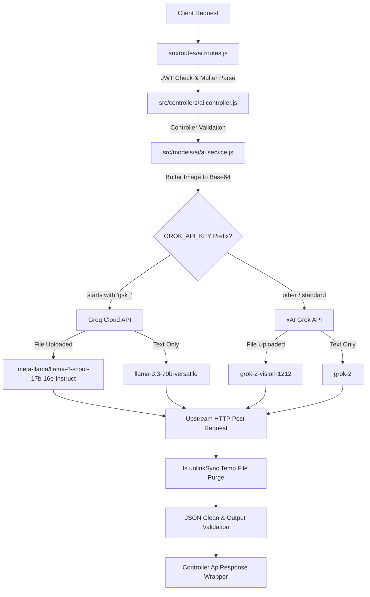

# SpendAI Backend AI Extractor - Architectural & Safeguards Manual

This guide is a comprehensive technical blueprint for backend developers, detailing the server-side architecture, dynamic routing pipelines, and strict edge-case defensive programming engineered for the **AI Expense Autofill Extractor API**.

---

## 📂 Architectural Overview (Backend Flow)

The AI receipt extraction service is decoupled into three major modules to enforce separation of concerns, scalability, and testability:



### 1. 🛣️ Route & Middleware Layer: `src/routes/ai.routes.js`
Defines the `POST /extract` route. Integrates JWT validation and standard multipart form-data parsing.
*   **Endpoint URL**: `/api/v1/ai/extract`
*   **Security Guard**: Global `protect` middleware ensures only authorized users with a valid JWT can invoke expensive model parse requests.
*   **Parser Guard**: `upload.single('receipt')` intercepts image streams and saves them to a temporary directory (`uploads/`).

### 2. 🎮 Request Controller Layer: `src/controllers/ai.controller.js`
Validates request presence and translates Express HTTP parameters (`req.body`, `req.file`) into raw inputs for the service layer. Wraps responses using the standardized `ApiResponse` structure.

### 3. 🧠 Core Service Layer: `src/models/ai/ai.service.js`
Performs Base64 image reads, selects the optimal LLM API and model name, compiles system prompts, executes HTTP requests, sanitizes output syntax, and cleans up temporary local files.

---

## ⚡ API Endpoint Specification

### `POST /api/v1/ai/extract`

Allows authenticated clients to post unstructured plain text (like SMS transaction notifications or copy-pasted invoice summaries) OR physical receipt files (`jpg`, `jpeg`, `png`, `gif`) to be extracted into structured financial fields.

*   **Authentication**: `Authorization: Bearer <JWT_TOKEN>`
*   **Input Mode A (Text-Only)**:
    *   **Content-Type**: `application/json`
    *   **Request Payload**:
        ```json
        {
          "rawText": "Spent $84.20 at Walmart for groceries on 2026-05-22"
        }
        ```
*   **Input Mode B (Receipt Upload)**:
    *   **Content-Type**: `multipart/form-data`
    *   **Form Fields**:
        *   `receipt` (Binary File, **Required**): An image of the receipt. Size cap: **5MB**.
        *   `rawText` (String, Optional): Accompanying text or notes.

*   **Successful Response (200 OK)**:
    ```json
    {
      "success": true,
      "statusCode": 200,
      "message": "AI expense extraction completed successfully",
      "data": {
        "amount": 84.2,
        "category": "Shopping",
        "date": "2026-05-22",
        "note": "Walmart groceries"
      }
    }
    ```

---

## 🛡️ Exhaustive Backend Edge-Case Defenses

To ensure maximum security and high service availability, the backend employs multiple layers of defensive coding:

### 1. Local Storage Leak Prevention (Strict Filesystem Purging)
*   **The Hazard**: If the upstream LLM API times out, crashes, or returns an error, uploaded files left in the `uploads/` folder could accumulate, quickly exhausting server disk space.
*   **Backend Defense**: The service handles files within a guaranteed `try-finally` lifecycle. The temporary uploaded receipt file is **always unlinked/purged** from the disk, regardless of whether the API call succeeds, times out, or throws an error:
    ```javascript
    try {
      // Base64 conversion and API dispatch...
    } finally {
      if (file && file.path) {
        try {
          fs.unlinkSync(file.path);
        } catch (unlinkErr) {
          console.warn('Failed to delete temp uploaded file:', file.path, unlinkErr.message);
        }
      }
    }
    ```

### 2. Malicious File Upload Defenses (MIME & Extension Guards)
*   **The Hazard**: Attackers could upload executable shell scripts or HTML files posing as receipt images to perform remote execution or XSS attacks.
*   **Backend Defense**: The `src/helpers/upload.helper.js` uses strict Regex pattern matching to inspect **both** the file extension and the verified MIME type before saving:
    ```javascript
    const allowedExtensions = /jpeg|jpg|png|gif|pdf|csv/;
    const isExtensionValid = allowedExtensions.test(path.extname(file.originalname).toLowerCase());
    const isMimeValid = allowedExtensions.test(file.mimetype);
    if (isExtensionValid && isMimeValid) {
      cb(null, true);
    } else {
      cb(new ApiError(400, 'Invalid file format. Supported: JPEG, JPG, PNG, GIF, PDF, CSV.'));
    }
    ```

### 3. Dynamic Model Auto-Routing
*   **The Hazard**: Running vision models on text-only requests wastes bandwidth, and running complex text models on vision requests crashes them.
*   **Backend Defense**: The backend dynamically detects key patterns and incoming formats to auto-route payloads to the cheapest and most specialized model:
    *   **API Provider Auto-Routing**: Keys starting with `gsk_` are routed to the highly optimized **Groq Cloud API** server. Other keys are routed to the **xAI Grok** server.
    *   **Vision Model Auto-Routing**: If a file is uploaded, the service promotes the call to vision models (`meta-llama/llama-4-scout-17b-16e-instruct` for Groq, `grok-2-vision-1212` for xAI).
    *   **Text Model Auto-Routing**: For text-only inputs, the service routes to ultra-fast text models (`llama-3.3-70b-versatile` for Groq, `grok-2` for xAI).

### 4. Robust JSON Extraction & Markdown Sanitization
*   **The Hazard**: Language models often output Markdown code fences (e.g. ` ```json ... ``` `) or conversational prefixes rather than a clean JSON string, which crashes a standard `JSON.parse` call.
*   **Backend Defense**: The backend enforces output safety in two steps:
    1.  **System Prompt Directives**: Instructs the LLM to return strictly raw JSON without markdown blocks.
    2.  **Regular Expression Cleaners**: Automatically detects and strips markdown tags or conversational surrounding text prior to parsing:
        ```javascript
        let cleanContent = content;
        if (cleanContent.startsWith('```')) {
          cleanContent = cleanContent.replace(/^```json\s*/i, '').replace(/```$/, '').trim();
        }
        const result = JSON.parse(cleanContent);
        ```

### 5. Safe DataType Casting & Schema Validation
*   **The Hazard**: The LLM might return an invalid category string, a null amount, or an invalid date string format, which would fail MongoDB schema validations when the user attempts to save the record.
*   **Backend Defense**: The parsed object undergoes strict post-extraction verification. If fields fail check parameters, safe, logical fallbacks are cast automatically:
    *   **Category Fallback**: Maps the extracted category to standard schema enums. If the LLM returns an unsupported category, it defaults to `"Other"`.
    *   **Amount Casting**: Enforces positive numbers. If missing or negative, it casts to `0`.
    *   **Date Formatting**: Checks for valid `YYYY-MM-DD` syntax using a strict Regex: `/^\d{4}-\d{2}-\d{2}$/`. If it fails or is missing, it defaults to the **current local date** (`new Date().toISOString().split('T')[0]`).
    *   **Descriptive Note**: Trims string outputs. If empty, it defaults to `"AI Extracted Expense"`.

---

*SpendAI Backend Services — Bulletproof AI Extraction Middleware.*
