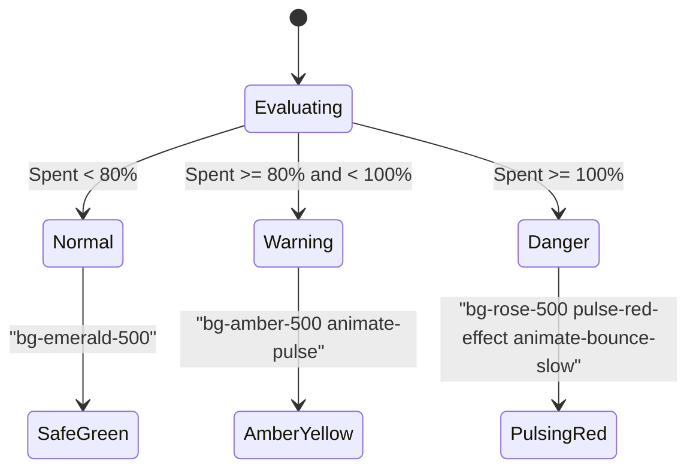

# SpendAI Budget CRUD & Progressive Alerts - Frontend Developer Integration Guide

This guide is a complete technical manual for frontend developers integrating the **SpendAI Budget CRUD and Alerts System** into a web dashboard (React, Vue, Angular, or Vanilla JS).

---

## 📂 Architectural Overview (Backend Files)

The budget management features are encapsulated across the following backend modules:

### 1. 🛣️ Route Configuration: `src/routes/budget.routes.js`
*   **Base Namespace**: `/api/v1/budgets`
*   **Security Guard**: Protected by the global `protect` JWT Bearer token middleware:
    `Authorization: Bearer <your_jwt_access_token>`

### 2. 🎮 Request Controller: `src/controllers/budget.controller.js`
*   Binds user credentials (`req.user.id`), route params (`req.params`), and query strings (`req.query`) to pass requests to the service layer.
*   Envelopes outputs in unified `ApiResponse.success` blocks.

### 3. 🧠 Business & DB Service: `src/models/budget/budget.service.js`
*   Manages budget upserts, database lookups, real-time alert calculations, and record deletions.

---

## ⚡ API Endpoint Specification

### 1. 🎯 Set Category Budget Target (Create / Update)
Sets or updates a monthly limit cap for a specific category of expenditure.

*   **HTTP Verb**: `POST`
*   **Path**: `/api/v1/budgets`
*   **Headers**:
    `Authorization: Bearer {{auth_token}}`
    `Content-Type: application/json`
*   **Request Payload (Joi Constraints)**:
    ```json
    {
      "category": "Food",
      "limit": 500.00,
      "month": "2026-05"
    }
    ```
    *   `category` (String, Required): Must be one of: `'Food'`, `'Transport'`, `'Utilities'`, `'Entertainment'`, `'Shopping'`, `'Other'`.
    *   `limit` (Number, Required): Must be greater than or equal to `0`.
    *   `month` (String, Required): Targeting calendar month in `YYYY-MM` format.

*   **Expected Response (200 OK / 201 Created)**:
    ```json
    {
      "success": true,
      "statusCode": 200,
      "message": "Budget threshold configured successfully",
      "data": {
        "_id": "664dd4e03d4a460a80e1a789",
        "user": "664dd4e03d4a460a80e1a123",
        "category": "Food",
        "limit": 500,
        "month": "2026-05",
        "createdAt": "2026-05-22T12:00:00.000Z",
        "updatedAt": "2026-05-22T12:00:00.000Z"
      }
    }
    ```

---

### 2. 📋 List Configured Category Budgets (Read)
Retrieves a list of configured budget limits set by the authenticated user.

*   **HTTP Verb**: `GET`
*   **Path**: `/api/v1/budgets`
*   **Headers**:
    `Authorization: Bearer {{auth_token}}`
*   **Query Parameters**:
    *   `month` (String, Optional): Filter results to a specific month in `YYYY-MM` format (e.g., `?month=2026-05`).
*   **Expected Response (200 OK)**:
    ```json
    {
      "success": true,
      "statusCode": 200,
      "message": "Configured category budgets listed successfully",
      "data": [
        {
          "_id": "664dd4e03d4a460a80e1a789",
          "userId": "664dd4e03d4a460a80e1a123",
          "category": "Food",
          "limit": 500,
          "month": "2026-05",
          "createdAt": "2026-05-22T12:00:00.000Z"
        }
      ]
    }
    ```

---

### 3. 🗑️ Delete Budget Target Record (Delete)
Permanently deletes a category budget limit.

*   **HTTP Verb**: `DELETE`
*   **Path**: `/api/v1/budgets/:id`
*   **Headers**:
    `Authorization: Bearer {{auth_token}}`
*   **URL Path Parameters**:
    *   `id` (String, Required): The 24-character hexadecimal MongoDB ObjectId representing the budget record.
*   **Expected Response (200 OK)**:
    ```json
    {
      "success": true,
      "statusCode": 200,
      "message": "Category budget limit target deleted successfully",
      "data": {
        "success": true
      }
    }
    ```

---

### 4. 🚨 Get Progressive Budget Alerts (Analytics)
Calculates real-time category expenditure totals against set budgets. Categorizes status alerts into safe levels, warnings, or danger thresholds.

*   **HTTP Verb**: `GET`
*   **Path**: `/api/v1/budgets/alerts`
*   **Headers**:
    `Authorization: Bearer {{auth_token}}`
*   **Query Parameters**:
    *   `month` (String, Required): The target calendar month to evaluate in `YYYY-MM` format.
*   **Expected Response (200 OK)**:
    ```json
    {
      "success": true,
      "statusCode": 200,
      "message": "Budget status alerts retrieved successfully",
      "data": [
        {
          "id": "664dd4e03d4a460a80e1a789",
          "category": "Food",
          "limit": 500,
          "spent": 420.50,
          "percentage": 84.10,
          "status": "warning",
          "month": "2026-05"
        }
      ]
    }
    ```

---

## 🎨 Progressive Warning Alerts (Gauge Schema)

The backend matches actual spends to set limits and attaches a `status` tag. Map this tag to CSS class templates directly to render responsive meters:



| Returning Status | Spending Level | Responsive UI Design Pattern |
| :--- | :--- | :--- |
| **`normal`** | `< 80% spent` | **Safe Green Gauge**: Use steady emerald/teal accents indicating healthy margins. |
| **`warning`** | `80% - 99.9% spent` | **Amber Yellow Gauge**: Pulse amber indicators to draw attention to shrinking margins. |
| **`danger`** | `>= 100% spent` | **Crimson Red Alert**: Apply pulsing crimson glow and alerts to indicate overspending. |

---

## 🏆 Visual Frontend Integration Guides

### 1. ⚛️ React & TypeScript Budget Manager Component
This complete React component enables users to set, list, and delete monthly budgets while showing interactive progress gauges.

```tsx
import React, { useState, useEffect } from 'react';

interface Budget {
  _id: string;
  category: string;
  limit: number;
  month: string;
}

interface BudgetAlert {
  id: string;
  category: string;
  limit: number;
  spent: number;
  percentage: number;
  status: 'normal' | 'warning' | 'danger';
  month: string;
}

export const BudgetManager: React.FC<{ currentMonth: string }> = ({ currentMonth }) => {
  const [alerts, setAlerts] = useState<BudgetAlert[]>([]);
  const [loading, setLoading] = useState(true);
  const [formData, setFormData] = useState({ category: 'Food', limit: '' });

  // 1. Fetch Real-time Progress Alerts
  const fetchProgressAlerts = async () => {
    setLoading(true);
    try {
      const response = await fetch(`/api/v1/budgets/alerts?month=${currentMonth}`, {
        headers: { Authorization: `Bearer ${localStorage.getItem('cord4_token')}` }
      });
      const res = await response.json();
      if (res.success) {
        setAlerts(res.data || []);
      }
    } catch (err) {
      console.error('Failed fetching budget alerts:', err);
    } finally {
      setLoading(false);
    }
  };

  useEffect(() => {
    fetchProgressAlerts();
  }, [currentMonth]);

  // 2. Configure (Upsert) Budget limit target
  const handleUpsert = async (e: React.FormEvent) => {
    e.preventDefault();
    if (!formData.limit || isNaN(Number(formData.limit))) return;

    try {
      const response = await fetch('/api/v1/budgets', {
        method: 'POST',
        headers: {
          'Content-Type': 'application/json',
          Authorization: `Bearer ${localStorage.getItem('cord4_token')}`
        },
        body: JSON.stringify({
          category: formData.category,
          limit: Number(formData.limit),
          month: currentMonth
        })
      });
      const res = await response.json();
      if (res.success) {
        setFormData({ ...formData, limit: '' });
        fetchProgressAlerts(); // Refresh gauges immediately
      }
    } catch (err) {
      console.error('Failed setting budget limit:', err);
    }
  };

  // 3. Delete configured limit target
  const handleDelete = async (budgetId: string) => {
    if (!window.confirm('Delete this budget target limit?')) return;

    try {
      const response = await fetch(`/api/v1/budgets/${budgetId}`, {
        method: 'DELETE',
        headers: { Authorization: `Bearer ${localStorage.getItem('cord4_token')}` }
      });
      const res = await response.json();
      if (res.success) {
        fetchProgressAlerts(); // Refresh gauges immediately
      }
    } catch (err) {
      console.error('Failed deleting budget:', err);
    }
  };

  return (
    <div className="grid grid-cols-1 lg:grid-cols-3 gap-6 p-6">
      
      {/* Configure Budget Panel */}
      <div className="bg-[#121628]/45 border border-white/7 p-6 rounded-2xl shadow-xl backdrop-blur-md">
        <h3 className="text-lg font-bold text-white mb-4 flex items-center gap-2">
          <i className="fa-solid fa-sliders text-indigo-400"></i> Configure Budget
        </h3>
        <form onSubmit={handleUpsert} className="space-y-4">
          <div>
            <label className="block text-xs font-semibold text-slate-400 mb-2">Category Channel</label>
            <select
              value={formData.category}
              onChange={(e) => setFormData({ ...formData, category: e.target.value })}
              className="w-full bg-[#1e233d]/70 text-white border border-white/10 rounded-xl px-4 py-2.5 outline-none focus:border-indigo-500"
            >
              {['Food', 'Transport', 'Utilities', 'Entertainment', 'Shopping', 'Other'].map(cat => (
                <option key={cat} value={cat}>{cat}</option>
              ))}
            </select>
          </div>
          <div>
            <label className="block text-xs font-semibold text-slate-400 mb-2">Monthly Spending Limit ($)</label>
            <input
              type="number"
              placeholder="e.g. 500.00"
              value={formData.limit}
              onChange={(e) => setFormData({ ...formData, limit: e.target.value })}
              className="w-full bg-[#1e233d]/70 text-white border border-white/10 rounded-xl px-4 py-2.5 outline-none focus:border-indigo-500"
            />
          </div>
          <button type="submit" className="w-full bg-indigo-600 hover:bg-indigo-700 text-white font-bold py-2.5 rounded-xl transition shadow-lg shadow-indigo-900/30">
            Apply Limit Cap
          </button>
        </form>
      </div>

      {/* Progress Alert Gauges (2 cols wide) */}
      <div className="lg:col-span-2 bg-[#121628]/45 border border-white/7 p-6 rounded-2xl shadow-xl backdrop-blur-md">
        <h3 className="text-lg font-bold text-white mb-4 flex items-center gap-2">
          <i className="fa-solid fa-gauge-high text-indigo-400"></i> Real-time Limits & Alerts
        </h3>
        
        {loading ? (
          <div className="text-center py-20 text-indigo-400"><i className="fa-solid fa-spinner animate-spin text-2xl"></i></div>
        ) : alerts.length === 0 ? (
          <div className="text-center py-16 text-slate-500">
            <i className="fa-solid fa-triangle-exclamation text-3xl opacity-20 mb-3 block"></i>
            <p className="text-sm font-medium">No budget limits configured for {currentMonth} yet.</p>
          </div>
        ) : (
          <div className="space-y-5">
            {alerts.map((item) => {
              const spentStr = `$${item.spent.toFixed(2)}`;
              const limitStr = `$${item.limit.toFixed(2)}`;
              const percentStr = `${item.percentage.toFixed(1)}%`;
              
              // Map alert status to Tailwind design tokens dynamically
              const theme = {
                normal: { color: 'bg-emerald-500', bg: 'bg-emerald-500/10', text: 'text-emerald-400', border: 'border-emerald-500/20' },
                warning: { color: 'bg-amber-500 animate-pulse', bg: 'bg-amber-500/10', text: 'text-amber-400', border: 'border-amber-500/20' },
                danger: { color: 'bg-rose-500 pulse-crimson-bar', bg: 'bg-rose-500/10', text: 'text-rose-400 border-rose-500/30', border: 'border-rose-500/20' }
              }[item.status];

              return (
                <div key={item.id} className={`p-4 rounded-xl border ${theme.border} bg-white/[0.01] hover:bg-white/[0.02] transition duration-300`}>
                  <div className="flex justify-between items-center mb-2">
                    <div className="flex items-center gap-2.5">
                      <span className={`px-2 py-0.5 rounded text-[10px] font-bold tracking-wide uppercase ${theme.bg} ${theme.text}`}>
                        {item.status}
                      </span>
                      <span className="font-bold text-white text-base">{item.category}</span>
                    </div>
                    <button onClick={() => handleDelete(item.id)} className="text-slate-500 hover:text-rose-400 text-sm transition">
                      <i className="fa-solid fa-trash-can"></i>
                    </button>
                  </div>
                  
                  <div className="flex justify-between text-xs text-slate-400 font-semibold mb-2">
                    <span>Spent: <strong className="text-white">{spentStr}</strong> / {limitStr}</span>
                    <span className={theme.text}>{percentStr} used</span>
                  </div>
                  
                  <div className="h-2 w-full bg-white/5 rounded-full overflow-hidden">
                    <div className={`h-full rounded-full transition-all duration-700 ease-out ${theme.color}`} style={{ width: `${Math.min(item.percentage, 100)}%` }}></div>
                  </div>
                </div>
              );
            })}
          </div>
        )}
      </div>

    </div>
  );
};
```

---

## 🛡️ Troubleshooting Checklist

### 1. `GET /api/v1/budgets` list returns empty arrays?
*   Verify the month parameter aligns exactly with stored configurations. Months must be absolute `YYYY-MM` matches (e.g. `2026-05`).
*   Ensure that the authorization header contains the authenticated JWT.

### 2. A category limit upsert throws validation errors?
*   Verify the date is structured as `YYYY-MM` and strictly passes the regular expression check: `/^\d{4}-\d{2}$/`.
*   Ensure the Category matches exactly one of the supported names (`Food`, `Transport`, `Utilities`, `Entertainment`, `Shopping`, `Other`) with standard capitalization.

---
*SpendAI Premium Budget CRUD Systems — Secure Threshold Configurations.*
